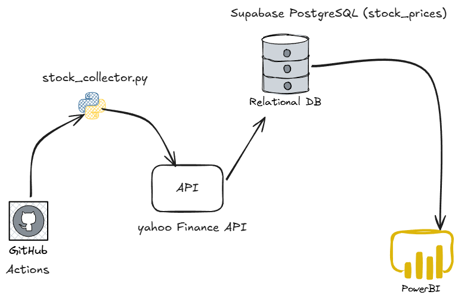

# Stock Data Streaming

Collect hourly stock prices from Yahoo Finance and store them in PostgreSQL for analysis with Power BI.



## Two Deployment Options

### Option 1: GitHub Actions (Free, Recommended)

Runs hourly data collection automatically using GitHub's free compute and Supabase free database.

### Option 2: Docker (Local Development)

Runs Kafka, PostgreSQL, and pgAdmin locally for testing and development.

## Quick Start (GitHub Actions)

1. **Create Supabase database** (free)
   - Go to [supabase.com](https://supabase.com)
   - Create project, copy connection string

2. **Configure GitHub**

   ```bash
   # Add secret: Settings → Secrets → Actions
   # Name: DATABASE_URL
   # Value: your-supabase-connection-string
   ```

3. **Files structure**

   ```
   your-repo/
   ├── .github/workflows/stock-data-collection.yml
   ├── stock_collector.py
   ├── config/stocks.json
   └── requirements.txt
   ```

4. **Deploy**
   - Push to GitHub
   - Go to Actions tab → Run workflow manually to test
   - Data collected hourly automatically

## Dashboard

[View Live Dashboard](https://app.powerbi.com/view?r=eyJrIjoiZDY5YjdiMWYtOTRlYS00MDdhLWE4M2QtNGRjNjFhMTE2NmRmIiwidCI6IjEyYjNhOGVhLWNmZTQtNDVkNS1hNDE1LWE1ZWMyNGRhMTJmYyJ9)

## Connect to Power BI

1. **Get Data** → PostgreSQL database
2. **Server**: `db.yourproject.supabase.co`
3. **Database**: `postgres`
4. **Credentials**: From your Supabase project settings
5. **Select**: `stock_prices` table

## Configuration

Edit `config/stocks.json` to change which stocks to track:

```json
{
  "stocks": ["NVDA",
            "MSFT",
            "AAPL",
            "GOOG",
            "AMZN",
            "META",
            "2222.SR",
            "AVGO",
            "TSM",
            "BRK-B",
            "TSLA",
            "JPM",
            "WMT",
            "TCEHY",
            "V"],
  "refresh_interval": 3600 # hourly
}
```

## Local Development (Docker)

```bash
# Create .env file
cp .env.example .env

# Start services
docker-compose up -d
```

Access:

- PostgreSQL: `localhost:5432`
- pgAdmin: `http://localhost:5051`

## Database Schema

```sql
stock_prices (
  id, symbol, open_price, high, low, close_price, 
  volume, market_cap, timestamp, date_only
)
```

## License

MIT License